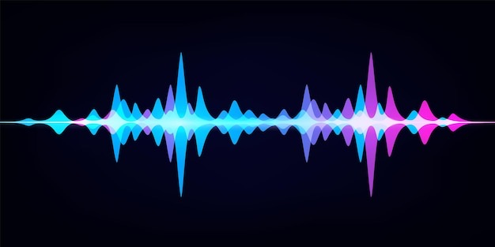
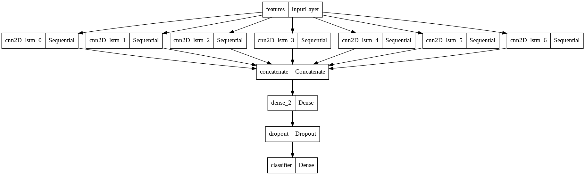
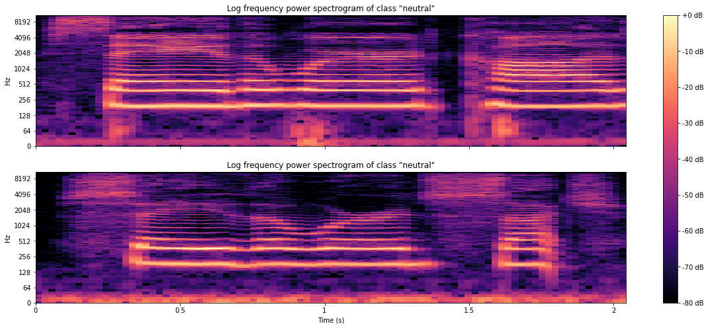

# VoiceVibes
VoiceVibes presents a solution for speech emotion recognition, featuring six innovative AI model architectures designed to accurately identify and categorize emotional expressions conveyed through speech.

  

## Introduction on Speech Emotion Recognition

Emotion plays an important role in human interactions. It helps us understand the feelings of others and conveys information about the mental state of an individual.  
Expressing and/or understanding feelings can be difficult for some people.  
What if we could understand the emotion of people only by listening to the tone of their voice?  
What if we could improve medical treatments/psychological follow ups with a simple emotion recognition based on the voice?   

By accurately recognizing and categorizing emotional expressions, emotion speech recognition technology can be used to **improve communication, build better relationships, and provide more personalized and empathetic experiences**. For example, in the field of mental health, it can be used to monitor and track changes in emotional states, providing early warnings of potential issues and helping healthcare professionals provide more effective treatment. 

In customer service, it can be used to enhance the customer experience by providing real-time feedback and support, making interactions more efficient and personalized.

In the entertainment industry, emotion speech recognition can be used to create more immersive and engaging content, while in education it can be used to provide feedback on presentations, public speaking skills, and other verbal communication skills, helping students and professionals improve their abilities.

## Task definition

The training and testing sets consist of audio files that were merged from 4 distinct data
sources ([TESS][1] , [SAVEE][2] , [RAVDESS][3] , [CREMA][4] ). The training set contains 10111 labeled audio files that can belong to 6 possible classes:
* Angry.
* Neutral.
* Disgust.
* Fear.
* Surprise.
* Happy.
* Sadness.

[1]: TESS: Toronto Emotional Speech Set. 2 female speakers (young and old), 2800 audio files, random
words were spoken in 7 different emotions.
[2]: SAVEE: Surrey Audio-Visual Expressed Emotion. 4 male speakers, 480 audio files, same sentences
were spoken in 7 different emotions
[3]: RAVDESS: 2452 audio files, with 12 male speakers and 12 Female speakers, the lexical features
(vocabulary) of the utterances are kept constant by speaking only 2 statements of equal lengths in 8
different emotions by all speakers.
[4]: CREMA: Crowd-Sourced Emotional Multimodal Actors Dataset. 7442 audio files, 91 different speakers
(48 male and 43 female between the ages of 20 and 74) of different races and ethnicities, different
statements are spoken in 6 different emotions and 4 emotional levels (low, mid, high and unspecified). 

## My solution
I propose six different architectures that exploits combination of Convolutional Neural Network (CNN), Long Short Term Memory (LSTM) and the Self-attention mechanism.
### Ensemble with Genetic Algorithm
In particular, I present three families of models, i.e. CNN-LSTM, LSTM-CNN and CNN-Transfomer, which are finally combined in an **ensemble**
that consider an average voting to get the final predictions, where the best combination of weights is found with a **Genetic Algorithm (GA).**

The ”ensemble” can exploit every model strengths and improve the coverage of the solution space.

### Stacking Ensemble
I also used a stacking ensemble technique to produce a **hierarchical model** with two levels:
1. **Base models:** there are several models trained on the same dataset that have different capabilities or different architectures.
2. **Meta model:** it receives the predictions of the base models and use them to determine the final label to assign to the sample.

I decided to adapt this technique, training an ensemble composed by seven base models, which have the same architecture, i.e. the CNN2D-LSTM, but they are
all **binary classifier** specialized in recognizing a certain class, and a Multilayer perceptron as meta model.

The architecture is shown in the figure below:

  

## Interpretability
I also propose a possible interpretation of the models output by analyzing the input that they receive, i.e. the **log mel spectogram** and the **chromagram**.

Here is an example of the Log mel spectogram obtained with two samples of the neutral class:

  

Please, check the [Documentation](VoiceVibes documentation.pdf) for a complete view. 
